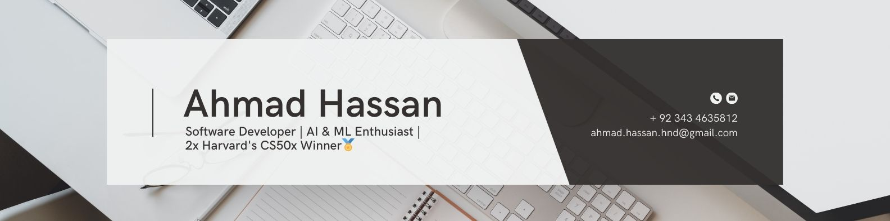

<h1 align="center">Hi 👋, I'm Ahmad Hassan</h1>
<h3 align="center">A passionate software developer from Pakistan</h3>

  

  

- 🌱 I’m currently learning **AI and ML models.**

- 📝 I regularly write articles on [https://ahmadhassan147.medium.com/](https://ahmadhassan147.medium.com/)

- 💬 Ask me about **python programming**

- 📫 How to reach me **ahmad.hassan.hnd@gmail.com**

- 📄 Know about my experiences [https://doc-0g-08-docstext.googleusercontent.com/export/rbrib6df5rn1kvvr0g0p0d6pn0/ghssr7q461uv1jp1rg13ik0cgs/1727646235000/103842002938609074828/103842002938609074828/1UhkIcbxHek2B4bi-lJNZjORK5cn5T4X-TPOzDD01XW0?format=pdf&id=1UhkIcbxHek2B4bi-lJNZjORK5cn5T4X-TPOzDD01XW0&token=AC4w5VgVgaDx4ZoPMQgZbN-fnsEch5pvgQ:1727646105811&includes_info_params=true&cros_files=false&inspectorResult=%7B%22pc%22:3,%22lplc%22:29%7D&dat=AOBvIb3ayI-yxc89G9LRfo4vj3oODCfiGYMTcAVjGEy-xF2zU2U7x6N2SQga4rsD4hm7EA9heuCP4VjnupizHWLqosGZ-AChijdAALtMALdDvTZHa0S6zPOXPZRQwqMOlrK9uR-Wf9Uoh1nCb7wMlJHEV-zCBZwsNd5OdhzJ_uy0_MSZOvtl2hGHMNK55FCKVZQssuCJvOJvbMkiF6AnWi01pPmG0HVI1up1CLOxD7iz7skqn-AU2nHhqQyef4Sr_ycF43t3RZE3avzR95O9mXRWLB8tDazJfyJLneSKrODsmu0DeVf8gp31Akv06jhUJfUjr0OifZDTEe7gQqKxdPDP94HYlGhT4VVPxPZfAlsh9Xkx0MxBVlM25OJoCzPcGu5ApsmRIZpGdIT0XrinhjUHjaxSPpkoK4taRkaSwP62SMyRNYITm097ExRUH_snzXcFuvFYF6reqYLeCTCVbsEJIA9Yn0vcWewKtcyrsn00s9jgTJVUFyV4CN9--WSabPkvpmR3T_CVTny4BhOUjANgZgIpJuETtsguxTBHZLPzColN7932Xy50IZJaqDHcDmlQb6T2j9DS8MrAAJlALXZW-k5XvBCQPl4yn8N8b4KO_UIjktzRcxB81vvDCvUha7EBVIUpGnvNHjvDlhFJGmLfPlCx0zMIiIZw23Sspuo4kUX2iXLQP0XVManpkxfM0Sz6QAiLg54nIrgA3nj-c_84fXMkviXgcvPHRemu76_ThcTHmryItn_NCKwQOKjydL9BDfzuzxbVKOL1Bslyc1-wnuRZlElJjzajHxhOXxFiZfR9h1et4xe0qWlnqdSKb0RWS5CYkcHb3dRZ4EvVvQdnJRqAMhNm0abddOBBGldTymugFpo-vMBwKIyG6EBYyNmn4GDC6XHUnqxmHtrEMMO0KDfCq5wKjBD0Xaqzduay92lLB99CZiB5jeM5cZD2r6w_rwRLFQpCJjEjt3PPoLwOAxvZ8IKv4sC1f2gGotD969HJZCQ6TuKvbjvuAsFH6vjIdN3UeQtGz6AtKW8_zl2fOhbLQHwsRQJrWE6Tu99TzZGolO6SkxSTxVe6GS25hyyMa7-IjW058-_kkigeZlSmTX5Jz2dBh48i0353zJLqNGwkNZ0j_OTp-38Oq9DpsR2Y7vQynhgLG47acdat9c9DQgCozaNpWNSax5Eq5Nm5Eo9h2vM](https://doc-0g-08-docstext.googleusercontent.com/export/rbrib6df5rn1kvvr0g0p0d6pn0/ghssr7q461uv1jp1rg13ik0cgs/1727646235000/103842002938609074828/103842002938609074828/1UhkIcbxHek2B4bi-lJNZjORK5cn5T4X-TPOzDD01XW0?format=pdf&id=1UhkIcbxHek2B4bi-lJNZjORK5cn5T4X-TPOzDD01XW0&token=AC4w5VgVgaDx4ZoPMQgZbN-fnsEch5pvgQ:1727646105811&includes_info_params=true&cros_files=false&inspectorResult=%7B%22pc%22:3,%22lplc%22:29%7D&dat=AOBvIb3ayI-yxc89G9LRfo4vj3oODCfiGYMTcAVjGEy-xF2zU2U7x6N2SQga4rsD4hm7EA9heuCP4VjnupizHWLqosGZ-AChijdAALtMALdDvTZHa0S6zPOXPZRQwqMOlrK9uR-Wf9Uoh1nCb7wMlJHEV-zCBZwsNd5OdhzJ_uy0_MSZOvtl2hGHMNK55FCKVZQssuCJvOJvbMkiF6AnWi01pPmG0HVI1up1CLOxD7iz7skqn-AU2nHhqQyef4Sr_ycF43t3RZE3avzR95O9mXRWLB8tDazJfyJLneSKrODsmu0DeVf8gp31Akv06jhUJfUjr0OifZDTEe7gQqKxdPDP94HYlGhT4VVPxPZfAlsh9Xkx0MxBVlM25OJoCzPcGu5ApsmRIZpGdIT0XrinhjUHjaxSPpkoK4taRkaSwP62SMyRNYITm097ExRUH_snzXcFuvFYF6reqYLeCTCVbsEJIA9Yn0vcWewKtcyrsn00s9jgTJVUFyV4CN9--WSabPkvpmR3T_CVTny4BhOUjANgZgIpJuETtsguxTBHZLPzColN7932Xy50IZJaqDHcDmlQb6T2j9DS8MrAAJlALXZW-k5XvBCQPl4yn8N8b4KO_UIjktzRcxB81vvDCvUha7EBVIUpGnvNHjvDlhFJGmLfPlCx0zMIiIZw23Sspuo4kUX2iXLQP0XVManpkxfM0Sz6QAiLg54nIrgA3nj-c_84fXMkviXgcvPHRemu76_ThcTHmryItn_NCKwQOKjydL9BDfzuzxbVKOL1Bslyc1-wnuRZlElJjzajHxhOXxFiZfR9h1et4xe0qWlnqdSKb0RWS5CYkcHb3dRZ4EvVvQdnJRqAMhNm0abddOBBGldTymugFpo-vMBwKIyG6EBYyNmn4GDC6XHUnqxmHtrEMMO0KDfCq5wKjBD0Xaqzduay92lLB99CZiB5jeM5cZD2r6w_rwRLFQpCJjEjt3PPoLwOAxvZ8IKv4sC1f2gGotD969HJZCQ6TuKvbjvuAsFH6vjIdN3UeQtGz6AtKW8_zl2fOhbLQHwsRQJrWE6Tu99TzZGolO6SkxSTxVe6GS25hyyMa7-IjW058-_kkigeZlSmTX5Jz2dBh48i0353zJLqNGwkNZ0j_OTp-38Oq9DpsR2Y7vQynhgLG47acdat9c9DQgCozaNpWNSax5Eq5Nm5Eo9h2vM)

- ⚡ Fun fact **Why do programmers prefer dark mode? Because light attracts bugs!**

<h3 align="left">Connect with me:</h3>

<h3 align="left">Languages and Tools:</h3>

                             

&nbsp;

